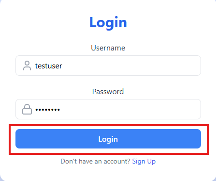

# SoundWav

## Description
SoundWav is an application for users to save shared Sound Cloud playlists from friends. Sound Cloud currently supports users having the ability to create a playlist and share with friends, but you must save a link to the address or navigate around in a clunky way. SoundWav allows users to create an account, add the playlist or share it, and it’s saved to your account.

## Licensing
There are no licenses required to use this application.

## Installation
- Open Visual Studio on your local computer.
- Navigate to the "SoundWav" repository.
- Right click on the "SoundWav" folder and select "Open In Integrated Terminal".
- Type "npm i" and click the "Enter" key.

## Update .env for JWT & MongoDB credentials

## How to Create a JSONWeb Token (JWT)

## How to Create a New SoundWav account
To create a new SoundWav account, follow these steps:

- Access the site at https://soundwav.onrender.com/.
- Click the "Sign Up" button.

- Provide a "Username" and "Password".
- Click the "Sign Up" button located directly below the "Password" text box.

- If the account creation is unsuccessful an error message will be displayed. If the account creation is successful, then you'll see the account night displayed at the top right corner of the page.

## How to Search for a Playlist to add to your account
- Access the site at https://soundwav.onrender.com/.
- CLick the "Search Playlists" button.

  
- Paste a SoundCloud playlist link into the Search textbox and click the "Load" button.

NOTE: The above search will work for all public playlists, however, if the playlist is private you'll need to get a link from your friend who owns the prive playlist. This will contain the secret token and will look like this -> https:api.soundcloud.com/playlists/1234567890?secret_token%value.

- The playlist will be display below to be played. Click the orange play button to play the playlist.
- To add the playlist to your profile, click the "Save to Profile" button.

## How to Remove a Playlist from your account
- Access the site at https://soundwav.onrender.com/.
- Click the “Login” button.
- Provide your username and password and click the “Login” button.
- Click the "Profile" button at the top right hand corner of the website.
- Your Profile page will load and display all playlists that are saved to your profile.  Click the "Unsave" button displayed below the Playlist that you would like to remove from your account.

## Follow a Friend
- Access the site at https://soundwav.onrender.com/.
- Click the “Login” button.
- Provide your username and password and click the “Login” button.
- Click the “Search Users” button.
- Enter your friends SoundWav username in the Search textbox and click the “Search” button.
- Your friends account will be returned below the Search textbox. Click the “View Profile” link displayed below the results Usernames.
- Click the “Follow” button.

## Github Actions
- Runs Super Linter on push to check code for errors/cleanliness

## Future Developments
-	Allow users to create their own playlists in Sound Cloud directly from our app.
-	Add Friends via our App so that they can get access to more playlists.

## Link to Deployed Site
The site is deployed to https://soundwav.onrender.com/.
